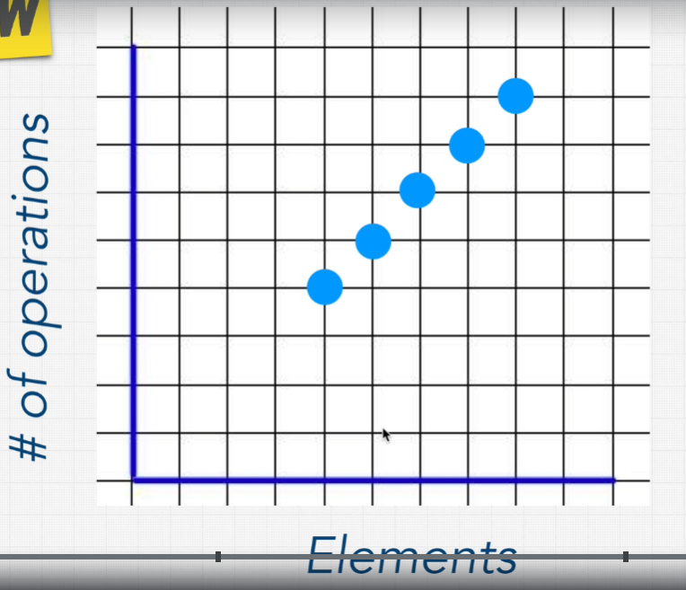

# Big O

https://zerotomastery.io/cheatsheets/big-o-cheat-sheet/?utm_source=udemy&utm_medium=coursecontent
https://dzone.com/articles/learning-big-o-notation-with-on-complexity
https://www.bigocheatsheet.com/

Big O Notation is `a metric` for determining `an algorithm's efficiency`. Put simply, it `gives an estimate` of `how long it takes your code` to run on `different sets of inputs`

This is how many operations a computer has to perform with a given elements. In the below, the O(1) is excellent

<br>

<br>

There are `4 rules` for Big O

1. Worst Case
2. Remove Constants
3. Different terms for inputs
4. Drop Non Dominants

<br>

# # O(1) - Constant Time

O(1) can be called `Big O of 1` or `Constant Time`. The `number of operation is one` no matter how big the input is

```
  function compressFirstBox(boxes) {
    console.log(boxes[1]); // O(1)
  }
```

# # O(n) - Linear Time

O(n) can be called `Big O of n` or `Linear Time`. It takes linear time complexity to perform the operations

```
  const nemo = ['jikai', 'alem', 'nemo', 'bonux', 'nemo'];
  function findNemo(array) {
    for (let i = 0; i < array.length; i++>) {
      if(array[i] === 'nemo') {
        console.log('Found NEMO!');
      }
    }
  }

  findNemo(nemo);

```

<br>

<br>

- If the items in array is 4, it takes 4 operations to find the nemo
- If the items in array is 5, it takes 5 operations to find the nemo
- If the items in array is 6, it takes 6 operations to find the nemo
- ...

# # O(log n)

# # O(n^2)

# # O(2^n)

# # O(n!) - Factorial Time
